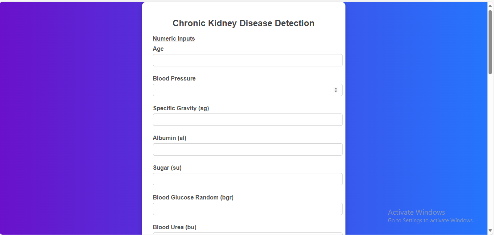
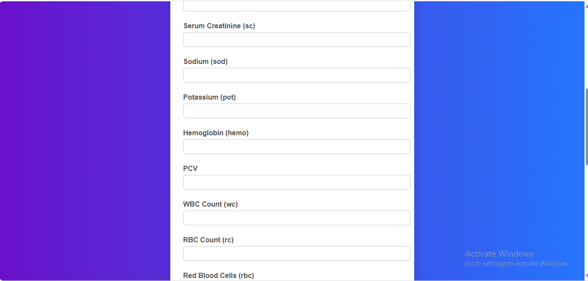
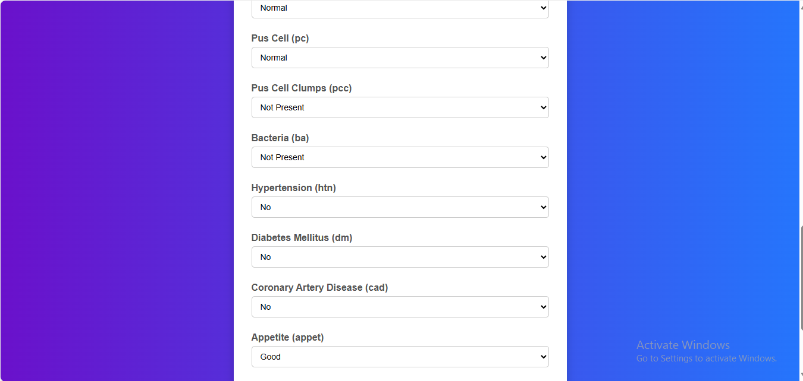

# Chronic Kidney Disease (CKD) Prediction Web App

## 📌 Project Overview
This project is a **Machine Learning-based Flask web application** that predicts whether a patient is likely to have **Chronic Kidney Disease (CKD)** based on clinical inputs.  
It provides an easy-to-use interface where users can enter medical details and receive predictions with confidence scores.  

- ✅ Built using **Python, Flask, Scikit-learn, Pandas, and Numpy**
- ✅ Uses **trained ML models** (Logistic Regression & Random Forest)
- ✅ User-friendly HTML templates with **visual result feedback** (happy/danger images)
- ✅ Outputs both **prediction result** and **confidence percentage**

---

## ⚙️ Installation & Setup
### 1. Clone or Download Project
```bash
git clone https://github.com/ayeshasayyedcodes/Chronic-Kidney-Disease-Detection-Prediction.git
cd Chronic-Kidney-Disease-Detection-Prediction
```

### 2. Install dependencies:
```pip install -r requirements.txt```

### 3. Run the Flask app:
```python app.py```

### 4. Open in browser:
http://127.0.0.1:5000/


### 🧪 Sample Test Inputs

✅ Healthy Example

age: 35, bp: 80, sg: 1.020, al: 0, su: 0, bgr: 100, bu: 20, sc: 1.0,
sod: 138, pot: 4.2, hemo: 15, pcv: 44, wc: 8000, rc: 5.2,
rbc: normal, pc: normal, pcc: notpresent, ba: notpresent,
htn: no, dm: no, cad: no, appet: good, pe: no, ane: no


❌ Unhealthy Example

age: 65, bp: 160, sg: 1.005, al: 4, su: 3, bgr: 300, bu: 100, sc: 5.2,
sod: 130, pot: 6.5, hemo: 8, pcv: 28, wc: 18000, rc: 2.9,
rbc: abnormal, pc: abnormal, pcc: present, ba: present,
htn: yes, dm: yes, cad: yes, appet: poor, pe: yes, ane: yes

## 🎥 Demo Video

📌 Here’s a quick demo of the CKD Detection Project:

[🎥 Watch Demo](Demo.mp4)

## 🚀 Future Enhancements

Deploy app on Heroku / Render / AWS

Improve model with more data & hyperparameter tuning

Add user authentication & history tracking

## 👩‍💻 Author

Ayesha Sayyed

🌐 GitHub: @ayeshasayyedcodes

## 🖼️ Screenshots
Homepage

Here are some views of the homepage form:





	

	
Results Page

Here’s how the prediction results look:


|
